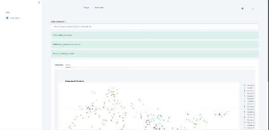

# Text and URL Clustering from Sitemaps

## Description

Ce projet utilise Python, FastAPI, et `trafilatura` pour extraire des textes de sitemaps et applique des techniques de machine learning pour regrouper les URLs similaires basées sur le contenu textuel extrait. Cette approche aide à organiser et à catégoriser les contenus web extraits pour des analyses plus approfondies ou pour améliorer la structure de navigation d'un site.



## Fonctionnalités

- **Extraction Asynchrone de Texte**: Extractions de texte non-bloquantes de multiples URLs en utilisant `asyncio` avec `trafilatura`.
- **Clustering de URLs**: Regroupe les URLs en clusters basés sur la similarité de leur contenu textuel, utilisant des techniques de NLP (Natural Language Processing).
- **Filtration Avancée d'URLs**: Exclut les URLs non pertinentes comme celles pointant vers des images ou des documents.
- **API REST avec FastAPI**: Permet une intégration facile avec d'autres applications ou services front-end.
- **Caching des Résultats**: Améliore les performances en réduisant la nécessité de recalculer les extractions et les clusters fréquemment.

## Installation

### Prérequis

- Python 3.8+
- pip

### Configuration

Clonez le dépôt et installez les dépendances :

```bash
git clone https://github.com/drogbadvc/text-cluster-extractor.git
cd text-cluster-extractor
pip install -r requirements.txt
```

### Démarrage de l'API

Lancez l'API localement :

```bash
uvicorn main:app --reload
```

Accédez à http://127.0.0.1:8000/ dans votre navigateur ou utilisez un client HTTP comme curl pour interagir avec l'API.

## Utilisation
### Endpoint API

Envoyez une requête POST à /load_urls avec un JSON contenant les URLs des sitemaps :

```json
{
  "sitemap_url": "https://example.com/sitemap.xml,https://example2.com/sitemap.xml"
}
```

## Traitement des URLs
1. Extraction de Texte :
L'API récupère et extrait les textes des URLs spécifiées dans les sitemaps.
2. Clustering :
Les textes extraits sont ensuite utilisés pour calculer des embeddings de texte avec des modèles de NLP. Les URLs sont regroupées en fonction de la similarité de ces embeddings, facilitant l'analyse des contenus similaires.

## Visualisation
   - `display_clusters.py` est utilisé pour visualiser les clusters. Ce script est basé sur la bibliothèque **plotly** pour créer des graphiques illustrant comment les URLs sont regroupées.


## Credit

[@AndellDam](https://twitter.com/AndellDam)